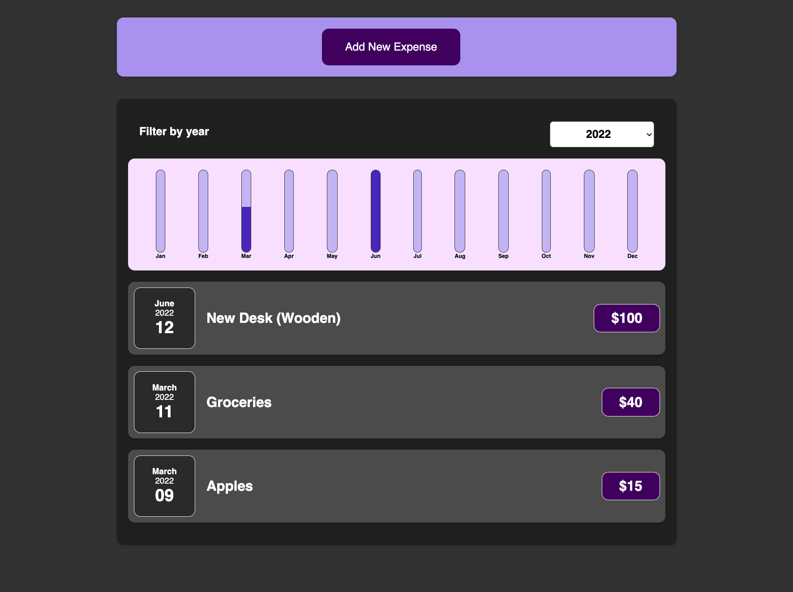

# Simple expense tracker app

### Master Branch Status:

[](https://github.com/dmrnz/simple-expense-tracker-app/actions/workflows/test.yml)
[](https://github.com/dmrnz/simple-expense-tracker-app/actions/workflows/lint.yml)
[](https://github.com/dmrnz/simple-expense-tracker-app/actions/workflows/deploy.yml)

### Develop Branch Status:

[](https://github.com/dmrnz/simple-expense-tracker-app/actions/workflows/test.yml)
[](https://github.com/dmrnz/simple-expense-tracker-app/actions/workflows/lint.yml)


<a href="https://simple-expense-tracker-app.netlify.app/">
    <!--suppress CheckImageSize -->
    
    <b>Demo</b>
</a>


## Run the app with Docker

```sh
git clone git@github.com:dmrnz/simple-expense-tracker-app.git

cd simple-expense-tracker-app

docker build -t expense-tracker .

docker run -it --rm -p 80:80 expense-tracker
```

Then open http://localhost/ to see production ready app.


## Contributing

```sh
git clone git@github.com:dmrnz/simple-expense-tracker-app.git

cd simple-expense-tracker-app

npm install

npm run start
```

Then open http://localhost:3000/ to see app in development mode.

## License

This App is open source software licensed as MIT.
